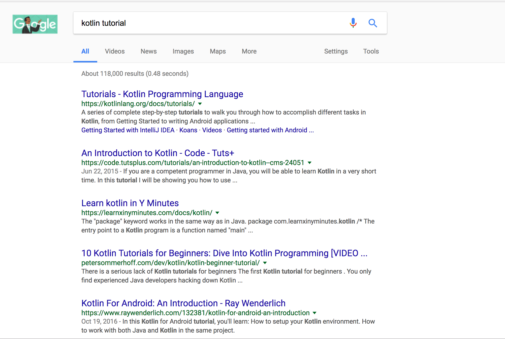
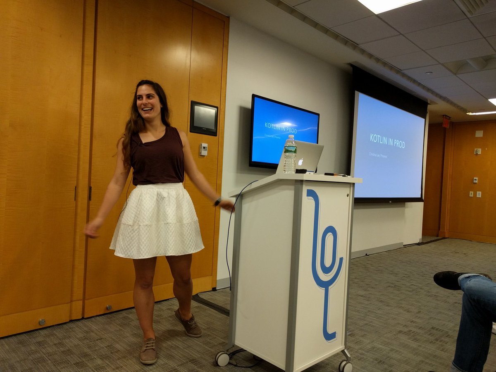
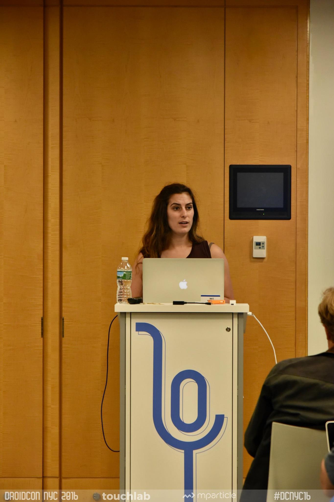

<!-- .slide: data-background="#5D6FA5" -->
<!-- .slide: data-state="terminal" -->
# Kotlin: A Retrospective 

Christina Lee |  Pinterest 
 

!!!

<insert company logos here>
Square
Pinterest
Trello
NYT 
(others?)

!!!

note: many tutorials available

!!!

## Null safety

!!!

## Mutability protection

!!!

## Lambdas

!!!

## Conciseness

!!!

## Interop

!!!

## Smart casting

!!!

## etc etc

!!!

# Beyond the basics

!!!

# Adoption costs

!!!

note: 1 year ago, did a retrospective

!!!

- all Kotlin
- less development bifurcation
- less release infrastructure 

!!!

## A lot has changed
### (like build times!) 

note: build times no longer top of mind
kotlin 1.1 released

!!!

- Wider adoption
- Added more tools to our app
- Grew the team
- Pushed more features

note: changes from Pinterest's perspective

!!!

1. People
2. Process
3. Tools

!!!

# People

note: people get least excited about this part, but it's the most influential piece

!!!

- Adoption
- Buy in
- Recruiting

!!!

# Adoption

Reasons not to force adoption:
- organic growth is powerful
- those most excited are best able to bear hardship

!!!

# Adoption

Reasons to force adoption:
- Java frustration/alienation
- split tooling upkeep, non-reproducible errors

note: need someone on call for java devs
Java devs update android studio, breaks Kotlin, we only have people looking at Java issues 

!!!

# Buy in

!!!

# Buy in

- Speak enthusiastically
- Take responsibility
- Gently point out use cases

!!!

# Recruiting

!!!

## People won't want to work here!

!!!

## There are so few Kotlin devs, it'll make recruiting even harder!

!!!

# Recruiting

- Advertising: Technical Brand
- Attraction: Kotlin enthusiasm is often a strong indicator
- Retention - old dogs, new tricks

note: Whether or not Kotlin lasts, the type of people attracted to Kotlin tend to be the same types who keep up with many different new technologies and think critically about their code. 
The integrated codebase gives us the recruiting "easy way out" because they can do either

!!!

# Process

!!!

- Precedents for when and how to use
- Integration of disparate skill sets (java devs + kotlin devs side by side)
- Code reviews
- Linters and style guides
- Separation of concerns (language choice versus architectural decision) -- changes how you architect solutions

!!!

# Precedents

- developer's choice, with caveats
- core code paths
- highly optimized paths

note: revisit this and clean up

!!!

# Integration 

- Manage emotions
- People talking a language you don’t understand in front of you
- Frustration
- Knee jerk reaction is to isolate and hide from changes

!!!

# Code Reviews
- Great place for learning to take place
- I still get a majority of my code reviews from Java devs
- This should not be a huge concern

!!!

# Linters and Style Guides

- talk early and often
- maintain a living document -- Kotlin is still evolving
- lever community support

notes: lack of style guidelines makes transition harder
early days of kotlin adoption == less code review oversight
!!!

# Style Guides

insert example

!!!

# Tools

!!!

# Tools
- Tooling failures and incompatibilities
- Updating release processes/tooling to accommodate hybrid codebase

!!!

# Tools

- Tooling failures and incompatibilities
    - Proguard
    - Gradle parallel builds 

!!!

# Tools

- Updating release processes
    - Parallel builds
    - Custom kotlin lint
    - Jenkins was hiccuping on Kotlin issues

!!!

# Open questions we still have

!!!

### Style guide is evolving

!!!

### Should we force people to adopt kotlin/proactively start converting files?

!!!

### How long does the “experiment” continue before we have enough info to make a call?

!!!

# Resources for devs looking to make the switch

!!!

Fix
- My earlier talks about Kotlin
- Hadi and Svetlana’s talks
- Reference Trello and NYT
- Jakes Kotlin talks

!!!

# That's all folks!

Slides posted: <a href="http://bit.ly/2d6WxQl">http://bit.ly/2d6WxQl</a>  

Find me on 

- Twitter: <a href="twitter.com/runchristinarun">@RunChristinaRun</a>
- Pinterest: <a href="https://www.pinterest.com/clehrlee/">pinterest.com/clehrlee</a>
