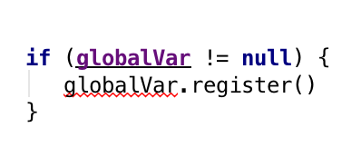
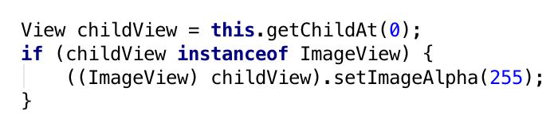
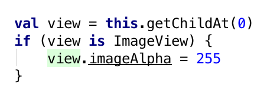
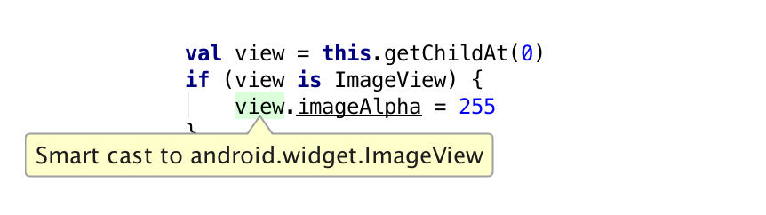
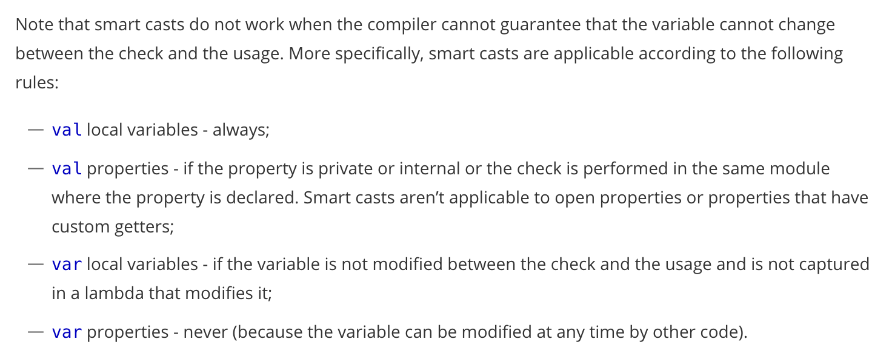

<!-- .slide: data-background="#5D6FA5" -->
<!-- .slide: data-state="terminal" -->
# Kotlin in Prod

Christina Lee |  Pinterest 
<br>

!!!

1. Kotlin & Android
2. Introduction at Scale

!!!

# What is Kotlin?

- JVM language
- from Jetbrains

note: breaking that down:
!!!

<div align="center">
*JVM*: INTEROP INTEROP INTEROP 
INTEROP INTEROP INTEROP 
INTEROP INTEROP INTEROP 
INTEROP INTEROP INTEROP 
INTEROP INTEROP INTEROP 
INTEROP INTEROP INTEROP 
</div>
 
!!!

<div align="center">
*Jetbrains*: tooling is top notch
</div>

!!!

<!-- .slide: data-background="#5D6FA5" -->
<!-- .slide: data-state="terminal" -->

# How does it affect Android?

!!!  

# What does it add?  

1. Null safety
2. Conciseness
3. Lambdas
4. Higher order functions
5. Mutability protection
6. Static typing + Smart Casts 

!!v

## Find more at:
<a href"https://kotlinlang.org/docs/reference/comparison-to-java.html"> https://kotlinlang.org/docs/reference/comparison-to-java.html </a>

!!!
# 1. Null safety


<div align="center" style="font-size:12px">
via GIPHY
</div>


note: Billion dollar problem, cannot over state what a big deal this is
!!!

## Nulls are part of the type system

!!!

# 1. Null safety

- Types default to non-nullable
- Mark nullable with the addition of a `?`

!!!

# 1. Null safety

```
var nonNullType: Type
nonNullType = null // compilation error

var nullableType: Type? 
nullableType = null // ok
```

!!!

# Null safety helpers

- Safe accessor: `?`
- Elvis opertator: `?:` 

!!!

# Working with nulls

```
// if messageFromServer is null, we'll display a default msg
val toDisplay: String = messageFromServer ?: defaultMessage

// cascading null safety
val maybeNullThing: Thing? = /* something */
val maybeName: String? = maybeNullThing?.someProperty?.name

// safe scoping
maybeNullThing?.let {
  // code will only be executed if not null
}
```

note: toy examples
!!!

# Working with nulls
```
        set(position) {
            playerControl?.setPosition(position)
        }
```

note: more robust example
!!!

# 2. Conciseness


<div align="center"  style="font-size:12px">
via GIPHY
</div>

!!!

## Java files consistently shrink

!!!

# 2. Conciseness

Java:
```
view.setOnClickListener(new OnClickListener() {
	@Override
	public void onClick(View v) {
		// do something
	}
});
```

!!!

# 2. Conciseness

Kotlin:
```
view.setOnClickListener { 
	//do something 
}
```

!!!

# 2. Conciseness

Kotlin:
```
view.setOnClickListener { view: View ->
	//do something with view
}
```

!!!

# 3. Lambdas

Many already familiar:
- Retrolambda
- Android Studio's lambda formatting

!!!

# 3. Lambdas

Enabling block for many other behaviors
- <a href="#/17">clean click listeners</a>
- <a href="#/22">higher order functions</a>

!!!  

# 3. Lambdas

Perks
- can be inlined: <a href="https://kotlinlang.org/docs/reference/inline-functions.html">"performant custom control structures"</a>
- closures

!!v

# More info: Java 8 lambdas

With limited support for Java 8 being rolled out on Android, you might wonder about J8 lambdas.
Here is a breakdown of some of the <a href"https://blog.jetbrains.com/kotlin/2016/03/kotlins-android-roadmap/">Kotlin/Java lambda differences</a>.
Also note <a href="http://bruceeckel.github.io/2015/10/17/are-java-8-lambdas-closures/">Java 8's closure scope</a> is more restrictive than Kotlin's.

!!v

# Inlined functions

- use `inline` keyword
- avoid object instantiation
- `return` behavior is `fun` level

note: non-local return


!!!

# 4. Higher order functions

> Higher order functions are functions which can take as arguments, or return as output, other functions

!!!

# 4. Higher order functions

```
public inline fun <T> Iterable<T>.forEach(
	action: (T) -> Unit // <-- input is a function
): Unit {
    for (element in this) action(element)
}
```

!!!

# 4. Higher order functions

```
fun <T, R> List<T>.map(transform: (T) -> R): List<R> {
  val result = arrayListOf<R>()
  for (item in this)
    result.add(transform(item))
  return result
}
```

!!!

# 4. Higher order functions

```
for (i in 0 .. icons.childCount - 1) {
	var icon : View = icons.getChildAt(i)
	if (icon is IconView) {
		resizeIconView(icon)
	} else {
		resizeActionView(icon)
	}
}
```
note: can be as simple as replacing a for loop so no manual indexing, might not seem like a big deal, but no more index out of bounds exceptions

!!!

# 4. Higher order functions

```
// no more indexing
icons.childrenSequence().forEach { view: View ->
	when(view) {
		is IconView -> resizeIconView(view)
		else -> resizeActionView(view)
	}
}
``` 

!!!

# 4. Higher order functions

```
allItems.map { item -> item.icon }
	.filterNotNull()
	.forEach { icon: Drawable ->
            calculateOptimalIconSize(icon)
        }
```

note: can also be more complicated

!!!

> "Went back and removed all my for loops. Really liking chained operators. firstOrNull with an expression brought down one of our models from 115 to 54 lines and I would argue its a lot easier now to see what the class is doing"

!!!

# 5. Mutability protection

Mutability notation is a requirement.  
You must choose `val` or `var`.

!!!

## Use `var` for something that will vary with time.  
## Use `val` for a value that won't change.

!!!

# 5. Mutability protection

The compiler is your friend!

!!!

# 5. Mutability protection

Java:
```
//no compiler warning:
if (globalVar != null) {
  globalVar.someField() // this can NPE
}
```

!!!

# 5. Mutability protection
Kotlin:


!!!

> Smart cast to 'GlobalVarType' is impossible, because 'globalVar' is a mutable property that could have been changed by this time

!!!

# Mutability Best Practice

- Always default to `val` until something needs to be made into `var`
- Compiler will flag non-mutating vars

!!! 

# 6. Static Typing + Smart Casts

*Shared*: static + strong typing
  
*Different*: compiler tracked smart casting

!!!

# Smart Casting

In Java:


!!!

# Smart Casting

In Kotlin:


!!!

# Smart Casting

In Kotlin:


!!!

# Smart Casting

- Compiler tracks `is`-checks
- Inserts safe casts* on your behalf
- Includes negative checks & short circuiting
- Sidenote: global vars

!!v

# More info: Safe Casts

Kotlin allows for both safe and unsafe type casting:  
```
/* UNSAFE */
val x: String = y as String //throws exception if cast fails

/* SAFE */
val x: String? = y as? String //null if cast fails
```

!!v

# More info: Vars + SC

Smart casting only applies if the compiler can guarantee that the field has not been mutated since the `is` check. 
From the <a href="https://kotlinlang.org/docs/reference/typecasts.html">Kotlin Docs</a>:



!!!


# Bonus: Better generics

TL;DR: Use site variance  
Read more: <a href="https://kotlinlang.org/docs/reference/generics.html">Kotlin docs</a>

!!!  

<!-- .slide: data-background="#5D6FA5" -->
<!-- .slide: data-state="terminal" -->

# How can you adopt it?

!!!

## Use IntelliJ
<div align="center">
Support for Eclipse is not competitive 
</div>

!!!

## Configure IntelliJ
<div align="center">
Install the Kotlin plugin
</div>

!!!

## Include the dependency
<div align="center">
736KB (as of 1.0.3)
</div>

note: runtime is relatively small at 736KB
!!!

<!-- .slide: data-background="#5D6FA5" -->
<!-- .slide: data-state="terminal" -->
# Adoption at Scale

!!!

# Context: 
- Highlight
- Pinterest

!!!

# Adoption Stages:

1. Recognition
2. Buy in
3. Integration
4. Interop

!!!  

# 1. Recognition

!!! 

## There is no solution if you don't have a problem.

!!!  


<div align="center" style="font-size:12px">
via GIPHY
</div>

note: maybe you're goin along like this. then keep going!

!!!

## If you don't look at Java and think, "this could be better", don't switch.

note: can't we do this in java? yes. you can write correct code in Java. But Kotlin makes it easier to write correct code. 

!!!

## But...


<div align="center" style="font-size:12px">
PinterestFail via <a href="http://www.boredpanda.com/baby-photoshoot-expectations-vs-reality-pinterest-fails/">BoredPanda</a>
</div> 


!!!

## Recognition --> Buy in

!!!

# 2. Buy in

!!! 


<div align="center" style="font-size:12px">
via GIPHY
</div>

note: it's hard to get things right

!!!


<div align="center" style="font-size:12px">
via GIPHY
</div>

note: and sometimes you might feel like this

!!!


<div align="center" style="font-size:12px">
via GIPHY
</div>

note: so sometimes releases can feel like this

!!!  

# 2. Buy in

> At scale, fractions of a percent of your users equal hundreds of thousands of crashes.  

!!!

# Hundreds of thousands of NPEs

!!!


<div align="center" style="font-size:12px">
via GIPHY
</div>

note: there's a way to eliminate NPEs overnight

!!!


!!!

# 2. Buy in

- keep track of issues/benefits
- lean into discussions with your platform team

!!!

# 2. Buy in

- is it stabile?
- how is perf?
- will it break s*&t?
- how's interop?

note: I have ansers to all these questions, but I have different tech stack than you

!!!

# 2. Buy in

> Get people on board, so that when you experience hiccups, you know why you should power through.

!!!

# 3. Integration

- piecemeal file introduction
- easy code conversion

!!!  

## Piecemeal file introduction
- no additional framework
- Kotlin exports Java interfaces 

!!!

# a few excited employees can lead the charge

note: compare to swift/obj c where you need to maintain bridging headers

!!!

<div align="center" style="font-size:12px">
via GIPHY
</div>

!!!

## Conversion
- right click conversion
- look for `!!`

note:
naive conversion from java compiles down to the same code, so you're exactly where you started
but this can be made better, so go through and clean up
this process will make it very clear how kotlin makes your code better

!!!

# 3. Integration

> Leaving behind years of experience

!!!

# 3. Integration

> There will be hiccups

!!!

# 3. Integration

Kotlin provides free getters and setters
```
Car car = new Car();
Car getCar() { ... }
void setCar(Car aCar) { ... }

car = Tesla() //Kotlin will call setter
```
!!!

# 3. Integration

```
resources.getDimension(...)

//instead of
getResources().getDimension(...)
```

!!!

# 3. Integration

Hiccup: does this for things prefixed with `is`
```
var isMute: Boolean

setMute(isMute: Boolean)
getMute(): Boolean
```

note: we know quirks like this in java, but have to learn them all again with kotlin

!!!

# 4. Interop

1. Technical
2. People

!!!

# 4. Interop

Technically: Fantastic

!!!

# 4. Interop

- Proguard
- Data binding 
- Retrolambda

!!!

# 4. Interop

People-wise: Darn good

!!!

## Syntax is very easily picked up by existing Java developers 
- readable by Java devs
- a few basic concepts get you a long ways

note: 
have polled devs to make sure lines are readable, and they always say yes 
only really need mutable, null, and (lesser degree) lambdas to get started 

!!!

## Code reviews benefit
- code reviews require only a small startup cost
- detail work handled by compiler

note:
Java developers continue to code review me
intracacies of Kotlin are caught by compiler -- nulls, mutability, etc, so are not on CR's shoulders

!!!

After a code review discussion of `for` loops
> "Went back and removed all my for loops. Really liking chained operators. firstOrNull with an expression brought down one of our models from 115 to 54 lines and I would argue its a lot easier now to see what the class is doing"

!!!

<!-- .slide: data-background="#5D6FA5" -->
<!-- .slide: data-state="terminal" -->

# Elephants in the (Adoption) Room

!!!

## Compile times
- historically slow
- vast improvements in the last year
- even more on the Kotlin roadmap 
- <a href="https://medium.com/keepsafe-engineering/kotlin-vs-java-compilation-speed-e6c174b39b5d#.icozs3xbo">Sometimes even faster than Java</a>

!!!

## Hey there Google!

- JVM is our friend
- JVM is not necessarily a savior

!!! 

# We have the chance to write the future!

!!!

# That's all folks!

Slides posted: <a href="http://bit.ly/2d6WxQl">http://bit.ly/2d6WxQl</a>  

Find me on 

- Twitter: <a href="twitter.com/runchristinarun">@RunChristinaRun</a>
- Pinterest: <a href="https://www.pinterest.com/clehrlee/">pinterest.com/clehrlee</a>
