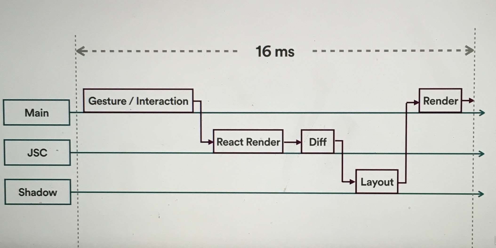

<!-- .slide: data-background="#5D6FA5" -->
<!-- .slide: data-state="terminal" -->
# Move fast with React Native

Christina Lee |  Pinterest 
<br>

!!!

# Background

note: before pinterest, worked at a startup of ~10

!!!


note: this was us

!!!

# We were iterating quickly!

!!!

- Highlight
- Roll
- View
- Shorts

note: to name a few

!!!

# We could not move fast enough with our current tools

!!!

## Why?

- Android:
	- no limit on apk uploads
	- slow adoption

!!!

## Why?

- iOS:
	- adoption is good 
	- review times can be long
	- possibility of rejection

!!!


<div align="center" style="font-size:12px">
source: http://appreviewtimes.com/
</div>

note: approval times have come down drammatically, but in the past, when we were developing, they could be up to two weeks
can also have updates be rejected, and we often did, so things are further of your control

!!!

# We needed a new tool!

!!!


!!!

# Timeline

- React quickly picked up a cult following
- First version of RN emerged from an internal FB hackathoon in 2013
- Initially launched May 2015, iOS only
- Android support came in September of 2015

note: about this time, RN was gaining popularity

!!!


<div align="center" style="font-size:12px">
Data source: Google Trends (www.google.com/trends)
</div>

note: ascended pretty darn quickly
yellow: RN
red: Android
blue: iOS

!!! 

# Claims to fame:

- Native apps written in JavaScript
- Use React --> "data flows down"
- No waiting for compilation

note: what did it have to offer?
also note this was the time that swift was being adopted, and it's compilation speeds were very slow

!!!

# Solved Problems

### 1) Iteration Speed (Code Push)

### 2) Limited Resources (Shared code)

!!!


!!!

<!-- .slide: data-background="#5D6FA5" -->
<!-- .slide: data-state="terminal" -->

# React Native In Practice

!!!

# But first,
# what is React?

note: but first, let's look at react a little bit
!!!

# React

- Component based view manager
- With a virtual dom
- & data passed via properties

!!!

# View Manager

React consists of components which usually implement
- Lifecycle callbacks
- `render()` function*
- Style sheets

*render() must be implemented

!!!

# View Manager

Typical react component:
```
export class SeparatorView 
	extends Component<SeparatorProps, void>{
  render() {
    return <View key={this.props.key} 
		style={styles.separatorContainer}>
      <View style={styles.separator}/>
    </View>;
  }
}
``` 

note: Simplest components just have a render func

!!!

# View Manager

Possibly some lifecycle/constructor funcs:
``` 
constructor(separtorProps: SeparatorProps) {
  // some constructor logic
}

componentWillReceiveProps(nextProps: SeparatorProps) {
  // do something
}

componentWillMount() {
  // do something
}
```

note: possible to implement lifecycle callbacks like these

!!!

# View Manager

And maybe some styling:
```
var styles = StyleSheet.create({
  separatorContainer: {
    width: SCREEN_WIDTH,
    alignItems: 'flex-end'
  },
  separator: {
    width: SCREEN_WIDTH - 80,
    height: 0.5,
    backgroundColor: Colors.GrayBorder,
  },
});
```

note: where styles are just defined with Flexbox

# Pros

!!!

# Virtual DOM

- allows React to be smart about re-rendering
- renders only smallest thing that has changed

!!!

# Properties

- properties are immutable and passed to child components
- ensures "data flows down"

!!!

## React == Reactive view layer

!!!

## React != State management layer

note: react is not a state management layer, use Redux or Cycle for that

!!!

# React Summary:

- view management
- using components & properties
- implemented with a virtual DOM

note: ok, moving along

!!!

# React vs React Native

- RN has same structure as React
- adds bridge + logic to render on native
- wraps native views & exposes to JS

!!!

<!-- .slide: data-background="#5D6FA5" -->
<!-- .slide: data-state="terminal" -->

# React Native: Pros

note: ok, now we can dive in

!!!

1. Code push
2. Cross-platform code
3. Access to web techs
4. Better developer velocity
5. Misc other benefits

!!!

# Code Push

> CodePush is a cloud service that enables Cordova and 
React Native developers to deploy mobile app updates directly 
to their users’ devices.

!!!

# Code Push

- Works as a central repo
- Can push updates to JS, HTML, CSS, etc
- App will query for updates using SDK

!!!

# Code Push Benefits

Allows for on the fly:
- fixing of bugs
- feature tweaks
- A/B testing

note: Pinterest deploys react 2x a day, iOS only once every two weeks

!!!

# Code Push Limitations:
- data usage
- needs to be downloaded
	-- tricky sequencing
- more complicated build processes
- might run afoul of Apple

!!! 

# Important Note on Hot Code

- Google: ¯\\_(ツ)_/¯
- Apple: Adheres to TOS, but fuzzy

!!!

"3.3.2 An Application may not download or install executable code. Interpreted code may only be used in an Application if all scripts, code and interpreters are packaged in the Application and not downloaded. The only exception to the foregoing is scripts and code downloaded and run by Apple's built-in WebKit framework, provided that such scripts and code do not change the primary purpose of the Application by providing features or functionality that are inconsistent with the intended and advertised purpose of the Application as submitted to the App Store."

!!! 

> "... provided that such scripts and code do not change the primary purpose of the Application..."

!!!

- Use your best judgement
- Hope that it matches Apple's

!!!

# Code Push Summary:

### Using React Native gives you Code Push.

### Code Push gives you design velocity and hot fixes.

!!!

# Cross Platform:

In Theory

- Write once, run anywhere(ish)
- Universal code means continual feature parity
- Eliminate overhead of maintaining 3 different teams
- More web devs available than mobile devs

note: support from Samsung and Microsoft, so can run on iOS, Android, UWP, xbox, smarts Tvs etc

!!!

# Cross Platform:

Caveat, Pt 1 
- Requires branching logic since platforms are divergent
- UIs are rarely 1:1
- Monolith code base

note: as RN gets more full featured, this'll get less bad

!!!

# Cross Platform:

Caveat, Pt 2
- Having a web dev write your mobile app requires the whole app to be RN
- This is only currently possible for trivial cases
- When dealing with costly data manipulations, perf must be moved to native code

note: as RN gets better, this will change

!!!

# Cross Platform:

Looking forward:
- active development means more platform parity
- open source solutions will surface
- RN optimizations will lessen perf concerns

!!!

# Access to web technologies:

- Web iterates faster than native
- Web has strong record with state management systems
- Encourages reactive programming

!!!

# Access to web technologies:

Of interest: 
- Flow
- Redux
- Cycle.js

!!!

## Web tends to have much better state management than native.

!!!

## Unidirectional data flow + immutable props unlock:
- simple debugging
- easy composition
- time travel
- data flow visualizations

note: these are possible, but more difficult, natively

!!!

# Developer Velocity:

Iteration Speed:
- React Native has hot reloading
- 2-3 second feedback loop
	- orders of magnitude less than on native

!!!

# Developer Velocity:

Debugging & Testing:
- Extensive debugging & testing tooling from rest of web
	- Can use Chrome tools and profilers
- Warnings surfaced in UI with yellow box
- Able to implement "time travel"

!!!  

# Other Benefits of React Native:

- Larger dev community == more resources
- Open source: not gated by RN dev speed
	- 8,224 commits by 1,038 contributors

!!!

# So to review:

1. Hot fix bugs
2. Updated features when *you* want
3. Share code across mobile & web
4. Faster development
5. Access to all of web's resources 

!!!

# Sounds pretty good!


<div align="center" style="font-size:12px">
via GIPHY
</div>

note: so far, everything seems pretty grand. Code push is an unequivical win, and while shared code isn't quite there yet, it has the potential to be

!!!

## But, wait. This doesn't come for free!


<div align="center" style="font-size:12px">
via GIPHY
</div>

!!!

# Cons

!!!

1. Performance
2. Interfacing
3. Architecting for Hot Code
4. Architecture Complexity
5. Onboarding
6. Scripting Language

!!!

# Performance

### Single JavaScript thread!

!!!

# Performance

JavaScript thread is where
- App lives
- touches are handled
- API calls are made
- etc.

!!!

# Performance

- At the end of each event loop, changes are sent back to native side, where they are handled on the UI Thread. 
- Occurs via bridge 
	- constant marshalling/unmarshalling of data 
	- perf tests suggest non-trivial amount of time spent here 


!!!

# Threading Model

Simplified 3 thread system:
1. Main: touch recieved
2. JS: touch handled, view diff created
3. Processing: layout calculated
4. Main: layout executed 

note: best explanation I've heard of comes from Airbnb's Felipe and Leland, used with permission 

!!!

# Threading Model


<div align="center" style="font-size:12px">
via Felipe & Leland, Airbnb
</div>


!!!

# Performance

Likely to see this rear it's head in:
- Navigations
- List/Grid/Collection Views
- Scrolling
- Non responsive touch events (b/c doing other processing)
- Animating images on iOS
- Using transparent backgrounds/alpha composition in general

!!!

# Performance

> Most of these have workarounds, but how many do you want to be responsible for?

!!!

# Interfacing

- Issues with performance often lead to a need for a hybrid app!
- Push expensive functionality to native code base

note: the perf issues directly lead into interfacing
!!!

# Interfacing

- This diminishes gains from web devs
	- You need to know mobile still!
- Requires maintenance of a bridging layer
	- Caveat for swifties: must be done in Obj-C

!!!

## But now that some code is native, what does that mean for Code Push?

!!!

## Answer: Bad Things

!!!

# Architecting For Hot Code

1. Performance needs improvement
2. You need to push some code to native side
3. Now you have a hybrid app
4. You still want to be able to code push hot fixes
5. ???

note: interfacing directly leads into architecture complexity

!!!

## In order to maintain ability to hot fix, you open your app's architecture.

note: because you don't know what you might need in the future, you need to add generic cases
open app architecture is generally bad

!!!

# Resist temptation!

- bad: exposing functions you don't yet need
- worse: reducing typesafety to account for input

!!!

# Architectural Complexity

>> Hybrid apps require construction of a communication layer to sync and manage the two sides

!!!

# Architectural Complexity

* done via bridge 
* communication optimized for JS -> Native
	- (Information flows down)

!!!

# Side note: Communication

JS -> Native
- JS can directly call native funcs exposed in modules
- woohoo!

note: woohoo! in my experience this works great
!!!

# Side note: Communication

Native -> JS
- Native can set new JS properties
- Callbacks (Experimental and finicky) 
- Events 

note: callbacks were a pain to work with, need to be formatted as an array, syntax is messy, not well documented
events are global and thus come with inherent risk and added complication

!!!

# Architectural Complexity

- Separation between db/networking and UI can lead to flashes
- Logic is difficult to get right
- Exacerbated by perf issues of sending synchronously via bridge 

note: likely want one db implementation for you hybrid app, otherwise need to sync those
if 1 impl, data needs to be passed over bridge = nightmare

!!!

# Onboarding

- Being good at RN still requires knowledge of native platforms
- Often falls on native developers to learn web tech
- Pardigm shift to reactive state management

!!!

# Language 

Languages are getting more powerful and typesafe!
- Obj-C --> Swift
- Java --> Kotlin

!!!

# Language 

Committing to JS
- gives up type safety
	- although can use Flow or Typescript
- loses out on powerful compilers

note: last but not least

!!!

<!-- .slide: data-background="#5D6FA5" -->
<!-- .slide: data-state="terminal" -->
# Practical Considerations

!!!

## Native will always be faster

### The question becomes: Are the tradeoffs worth it?

note: to start, we should acknowledge that native will always be faster if done right 
!!!

## Ships with a non-trivial APK, adds to app size

note: an issue on android, because of dex limits
also note, ships with fresco... if you already have an image library, you don't want a dupe
also ships with JSCore binaries for both x86 and ARM
!!!

## Giving up device power for development speed

!!!

## RN moves fast, but you might still have to write your own wrappers

!!!

## Still not at 1.0

note: bugs and missing features are assured
!!!

## User data/autonomy concerns

note: pushing too many updates can piss off users for downloading not on wifi
also, if a user doesn't want to update, is it ok to force it on them? your call, but tricky 
note that pinterest app store has a lot of people who want the old version of the app

!!!

## The Apple line is fuzzy, and you must always be careful

note: severe consequences if you cross this line

!!!

## Code push deployment will likely require a new system

note: most companies already have a deployment system, but code push will have to be added/built out
!!!

## Most likely will implement a hybrid app, will likely still need specialists

note: the dream is to have one team who can write for all platforms, but this is unlikely, at least now

!!!

## Weaker types and compilers will likely cause bugs, but they can now be fixed in prod 

!!!  

## Faster development loop
## vs
## more complicated architecture

!!!

<!-- .slide: data-background="#5D6FA5" -->
<!-- .slide: data-state="terminal" -->
# My experience

!!!

## Despite the downsides, we'd do it again.

!!!

# Triumphs
1. Release cycle speedup was crucial
2. Fixing bugs in the wild is invaluable
3. Used often for feature development
	- Led to more exploration!

!!!

# Stumbles
1. Had to expose our own modules for 3D touch
2. Had 2 people on DB, one to manage rest of React
	- DB communication is complicated!
3. Fought dropped frames in UI

!!!

<!-- .slide: data-background="#5D6FA5" -->
<!-- .slide: data-state="terminal" -->
# Final Recommendation:

!!!

## Given trade offs, deploy to the most likely to change part of your app, leave the rest native to start

!!!

# That's all folks!

Find me on 
- Twitter: <a href="twitter.com/runchristinarun">@RunChristinaRun</a>
- Pinterest: <a href="https://www.pinterest.com/clehrlee/">pinterest.com/clehrlee</a>
