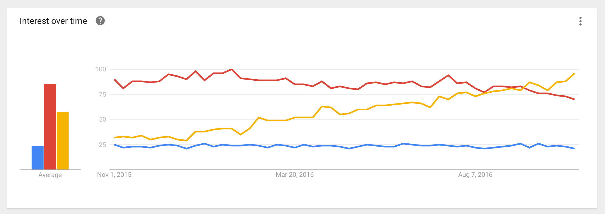

<!-- .slide: data-background="#5D6FA5" -->
<!-- .slide: data-state="terminal" -->
# Move fast with React Native

Christina Lee |  Pinterest 
 

!!!

# Background

note: before pinterest, worked at a startup of ~10

!!!

note: this was us

!!!

# We were iterating quickly!

!!!

- Highlight
- Roll
- View
- Shorts

note: to name a few

!!!

# We could not move fast enough with our current tools

!!!

## Why?

- Android:
	- no limit on apk uploads
	- slow adoption

!!!

## Why?

- iOS:
	- adoption is good 
	- review times can be long
	- possibility of rejection

!!!

source: http://appreviewtimes.com/

note: app times have come down drammatically, but in the past, when we were developing, they could be up to two weeks
can also have updates be rejected, and we often did, so things are further of your control

!!!

# We needed a new tool!

!!!

!!!

# Timeline

- First version of RN emerged from an internal FB hackathoon in 2013
- Initially launched May 2015, iOS only
- Android support came in September of 2015

note: about this time, RN was gaining popularity

!!!

Data source: Google Trends (www.google.com/trends)

note: ascended pretty darn quickly
yellow: RN
red: Android
blue: iOS

!!! 

# Claims to fame:

- Native apps written in JavaScript
- Use React --> "data flows down"
- No waiting for compilation

note: what did it have to offer?

!!!

# Solved Problems

### 1) Code push

### 2) Shared codebase

