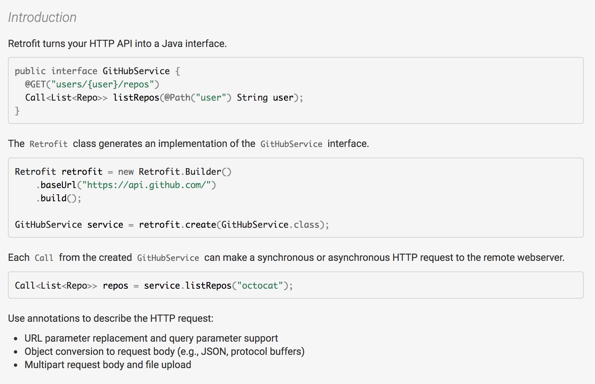
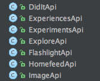
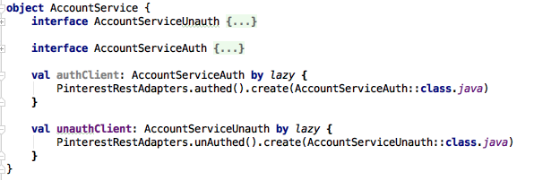

<!-- .slide: data-background="#5D6FA5" -->
<!-- .slide: data-state="terminal" -->
# Retrofitting Retrofit

Christina Lee |  Pinterest 
<br>

!!!

# Networking

!!!

> "If you see something [on your phone], it involved the network"

note: telling Boo about networking layer

!!!


!!!


note: hashtag not qualified

!!!


note: hashtag help

!!!

# Retrofit expert?


!!!


!!!

## We have a networking layer that mostly works but is hard to modify and is based on technologies from 5 years ago expert?

!!!


<div align="center" style="font-size:12px">
<a href="https://giphy.com/gifs/excited-yes-agree-jErnybNlfE1lm">via GIPHY</a>
</div>

!!!

 

note: it's important to realize those are two different things

!!!


!!!

<table>
  <tr>
    <td>  </td>
    <td>  </td>
  </tr>
</table>

!!!

 

note: because if you don't already have a code base...

!!!

### <div style="text-align: center">Interface,<br>Builder,<br>Call,<br>Annotations<br></div>

# <div style="text-align: center"> BOOOM </div>

note:
- which makes it all look easy

!!!

# Let's do a trial!

note: 
- not going to wholesale swap willy nilly
- need test case and validation to get approval

!!!


note: 
- but what?
- if you're like us, you have several modules that separate network calls based on features

!!!



note: this begs the question which one do you choose?

!!!

<blockquote class="twitter-tweet" data-conversation="none" data-lang="en"><p lang="en" dir="ltr">My favorite bit of any talk I give is talking about the dumb shit I did so the audience doesn’t do it. Makes the hair pulled out worth it.</p>&mdash; Ellen Shapiro (@designatednerd) <a href="https://twitter.com/designatednerd/status/841800315003379712">March 14, 2017</a></blockquote>
<script async src="//platform.twitter.com/widgets.js" charset="utf-8"></script>

note: now's a good time to mention

!!!

# Account API

note: 
- I chose the account API because AUTH AND UNAUTH!
- I was thinking about this from a technical perspective, not a practical one

!!!

# Feed API

note: 
- but what this ignored was that our feed was the most important litmus test
- once I completed the account api there were still a lot of unknowns
- spend more time on this, choose wisely for maximum learning

!!!

## Lesson 1: Choose your test case with care

!!!

## Lesson 2: Be diligent about setup

!!!

## Are you an Rx1 holdout?

note: 
- one of the benefits of Retrofit is exposing streams
- this was a big reason we wanted to adopt it

!!!

```
packagingOptions {
  exclude 'META-INF/rxjava.properties'
}
```

note:
- not retrofit explicit
- rx1 and rx2 include the same file

!!!

# Phew!

note: but theres more

!!!

```
java.lang.IllegalArgumentException: Unable to create call 
  adapter for io.reactivex.Observable<T<Map<U, V>>>
```

!!!

``` 
compile 'com.squareup.retrofit2:adapter-rxjava2:2.2.0'
```
<br>  
```
Retrofit.Builder()
  .addCallAdapterFactory(RxJava2CallAdapterFactory.create())
```

!!!

# Also Proguard

note: difficult because retrofit heavily uses reflection

!!!

> "We recommend you just keep everything in each library until you are comfortable with tweaking and testing the values yourself. Keeping everything is especially useful in complex libraries like this since we rely heavily on reflection for certain aspects of the configuration which breaks with stripping and obfuscation." 

<center>
\- <a href="https://github.com/square/retrofit/issues/117">JW comment on Github Issues</a>
</center>

!!!

```
-dontnote retrofit2.Platform
-dontwarn retrofit2.Platform$Java8
-keepattributes Signature
-keepattributes Exceptions
```

note: 
- from the retrofit docs: http://square.github.io/retrofit/
- but there are other suggestions out there too

!!!

# Lesson 3: Don't hate the player, hate the switch

!!!

```
public static void login(/*params*/, /*handler*/) {
	// some logic
	switch (params.getType()) {
		case SignupParams.TYPE_FACEBOOK:
			paramsMap.put("fb_id", params.fbId);
			paramsMap.put("fb_token", params.fbToken);
			path = "facebook/";
			break;
		case SignupParams.TYPE_EMAIL:
			path = "email/";
			break;
		...
	}
	// more logic
}
```

note: 
- because building out products happens iteratively, you most likely have something like this
- common form of networking tech debt
- write a login, then add more ways to login and expand the original func
- there are two main issues with this

!!!

```
if (params.emailAddress != null) {
	paramsMap.put("email", params.emailAddress);
}
if (params.username != null) {
	paramsMap.put("username", params.username);
}
if (params.password != null) {
	paramsMap.put("password", params.password);
}
```

note:
- issue 1: you get code like this
- different login types require different args so can't make them all mandatory

!!!

# "We're a package deal!"

note: 
- issue 2: login types are closely coupled for no good reason
- modifying facebook login can very possibly break email login

!!!

```
@FormUrlEncoded
@POST("something/facebook/")
fun facebookSignup(
  @Field("facebook_id") facebookId: String,
  @Field("facebook_token") facebookToken: String,
) : Observable<T>

@FormUrlEncoded
@POST("something/twitter/")
fun twitterSignup(
  @Field("twitter_id") twitterId: String,
  @Field("twitter_token") twitterToken: String,
  @Field("twitter_token_secret") twitterTokenSecret: String,
) : Observable<T>
```

note: 
- we're good citizens, so let's fix this/break these up

!!!

# Hurray! We win!

note: 
- cool, this seems objectively better

!!!

# But...

note: 
- shared logic across login events

!!!

# Where do we put shared behavior now?

note:
- not for me to say, developer dependent
- but you'll need to think about this

!!!

## When adding Retrofit retroactively, switches will be among your most time intensive migrations.

note: this is not a problem when you build with it from the start

!!!

# Lesson 4: With great interceptor power, comes great interceptor responsibility

!!!

## Background: We already used OkHttp

note:
- but like most things, it didn't start that way and was added later
- focus on going from Apache to OkHttp
- didn't take advantage of interceptors even though we could have

!!!

## Interceptors: 

- usually used to add/remove/change headers
- can also be used for crazy shenanigans like <a href="https://publicobject.com/2016/01/17/sneaking-data-into-an-okhttp-interceptor/">this</a>

!!!

# Christina's Shortcut Guide to Interceptors:

### Check your `get()`/`post()`/`put()` funcs

note: 
- most of what you will need to build out to interceptors currently resides in these funcs

!!!

# Logic shared by all calls

note:
- while interceptors can be used for one off things, start with modifications you make to all/most requests

!!!

- Oauth Signing
- Token 

---

- Auth Signing
- Refresh 

note: 
- bare minimum interceptors you'll probably need to add

!!!

# Aside:


note: 
- context on our setup
- another way to do this is with headers and annotation

!!!

- Oauth Signing
- Token 

---

- Auth Signing
- Refresh 

!!!

- Oauth Signing
- Token Interceptor
- Logging

---

- Auth Signing
- Refresh Interceptor
- Logging

note: 
- and of coourse don't forget logging
- but logging can be pulled in from open source

!!!

# Lesson 5: Who rules the world? Errors!

note:
- two concerns:
- who handles validation (error clientside versus malformed call with server returned error) 
- propogating erorrs

!!!

# Who handles validation?

!!!

```
if (params.emailAddress != null) {
	paramsMap.put("email", params.emailAddress);
}
if (params.username != null) {
	paramsMap.put("username", params.username);
}
if (params.password != null) {
	paramsMap.put("password", params.password);
}
```
note: 
- remember this slide?
- the structure of our old networking layer pushed us towards server validation
- this gives flexibility, but there are drawbacks too

!!!

```
@FormUrlEncoded
@POST("login/")
fun loginWithEmail(
  @Field("username_or_email") usernameOrEmail: String,
  @Field("password") password: String
) : Observable<T>
```

note: 
- the username or email is no longer optional for this endpt
- it is not required to move to this way of doing things, but it becomes an easier option
- nulls will be stripped out

!!!

# While we're here

!!!

# Lifting Errors

note:
- a networking layer written years ago, likely hasn't been updated to lift errors
- when rewriting to Retrofit, this can be a big win

!!!

```
interface Callback<R, E> {
  void onSuccess(R body);
  void onClientError(E errorBody);
  void onServerError(String message);
  void onUnauthenticated();
  void onFailure(IOException e);
}
```
\- <a href="https://speakerdeck.com/jakewharton/making-retrofit-work-for-you-droidcon-uk-2016?slide=218">JW @ DroidCon UK '16</a>

note:
- one proposed solution
- instead of rewriting these checks over and over, do them once and give the user the least granular action item they need

!!!

# For Rx:

- Connection errors (IOException)
- Non 200 error (HTTPException)
- Custom error codes sent with 200 resp

note: RX error handling can be tricky


!!!

```
thing.subscribe(
  { next -> 
    if (next.resultCode == 0) { /*handle success*/ } 
    else { /*handle custom error*/ }
  },
  { error -> 
    // handle connection error
    // handle non 200 error
  }
)
```

note:
- can use call adapter to route all errors through on error
- might not be good (error terminates stream) but it's an option

!!!

```
thing.subscribe(
  { next -> 
    // handle success
  },
  { error -> 
    // handle connection error
    // handle non 200 error
    // handle custom error
  }
)
```
!!!

# Lesson 6: Inheritance based callbacks are a nightmare

note: 
- assumes Rx call adapter
- many apps have inheritance overuse issues
- one of the most perplexing parts of this migration was how to deal with inherited callbacks
 
!!!

```
HomePinFeedApiResponseHandler
FeedApiResponseHandler
ApiResponseHandler
BaseApiResponseHandler
Response.Listener/ErrorListener/HeaderListener
```

!!!

# Simple solution:

```
HomefeedService.submitLoad(pageSize, 0)
.subscribeOn(Schedulers.io())
.subscribe(
  new SingleObserver<ApiResponse>() {
    @Override
    public void onSuccess(ApiResponse value) {
    // Route to existing handler
      _homeFeedHandler.onSuccess(value); 
    }
  })
```

!!!


note:
- TADA, we've kicked the can down the road
- it's important to note that this is a possibility
- we don't live in a vaccuum
- practical considerations like this can make or break a project

!!!

# "Real" Solution: Rx Wonderland

!!!

## [insert answer here]

note:
- would love to give an answer on this, but I'm still trying to settle on my final solution
- DSL?

!!!

# Lesson 7: If you haven't adopted Kotlin, you're missing out

note: 
- this is a laugh line, but it really is impressibe how far our tooling has come 
- includes Rx too
- in general tools have gotten better

!!!

- nullable types enforce request structure
- default arguments streamline calls

note: 
- I tried to do this in Java first, I really did

!!!

1. Choose your test wisely
2. It's easy to miss setup steps
3. Switch-statements are time sucks
4. Start thinking in Interceptors
5. Up your error game
6. Rx? Callbacks will need a solution
7. Kotlin works well with networking

note:
-recap
!!!

1. Testing
2. Mocking/Conditioning
3. Profiling

note: these deserve their own talk

!!!

# That's all folks!

Slides posted: <a href="http://bit.ly/2d6WxQl">http://bit.ly/2d6WxQl</a>  

Find me on 

- Twitter: <a href="twitter.com/runchristinarun">@RunChristinaRun</a>
- Pinterest: <a href="https://www.pinterest.com/clehrlee/">pinterest.com/clehrlee</a>
